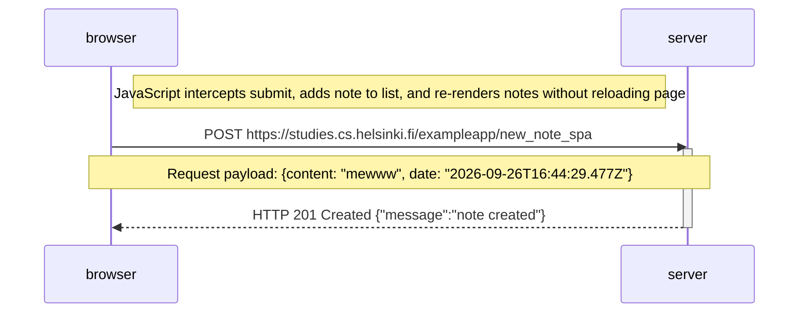

```mermaid
sequenceDiagram
    participant browser
    participant server

    Note right of browser: JavaScript intercepts submit, adds note to list, and re-renders notes without reloading page
    
    browser->>server: POST https://studies.cs.helsinki.fi/exampleapp/new_note_spa
    activate server
    Note over browser,server: Request payload: {content: "mewww", date: "2026-09-26T16:44:29.477Z"}
    server-->>browser: HTTP 201 Created {"message":"note created"}
    deactivate server
```